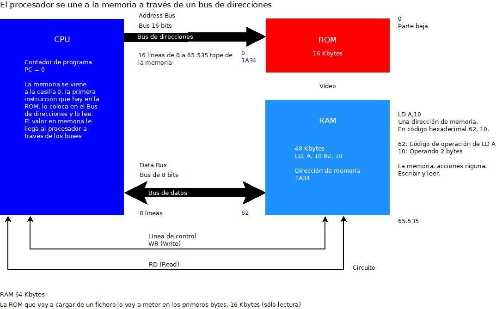

# Zilog z80



## Interno:
- Parte alta
- Parte baja

### Banco de registros
- BC (16 bits) - B (8 bits) C (8 bits)
- DE (16 bits) - D (8 bits) E (8 bits)
- HL (16 bits) - H (8 bits) L (8 bits)
- IX (16 bits puro) - Indexar array
- IY (16 bits no se pueden romper en dos de 8 bit) - Indexar array 
- SP (16 bits) Registro de pila: cuando se llama a una función o subrutina el registo de pila almacena en memoria la dirección de retorno donde tiene que volver esa función cuando termine.
- AF - A (8 bits) F (8 bits) Nunca se puede trabajar como 16 bits, son los registros más importante de la máquina.
- A es el registro ACUMULADOR, todas las operaciones aritméticas y lógicas tienen como resultados el registro A. Acumula todos los resultados parciales de todas las operaciones.
- F Flags (Estado): determina si salta, no salta, paridad par o impar. EN QUE ESTADO ESTÁ LA MÁQUINA. Está codificado a nivel de bits.

### REGISTROS ALTERNATIVOS
- B'C' Son registros para copia. Si los registros anteriores se quedaban corto te daba la posibilidad de guardar. Lo vuelcas en los primas y cuando quieras recuperar haces otro intercambio en los originales.
- D' E' - Banco alternativos. No se puede ir de uno en uno.
- H' L'
- A' F'

### REGISTROS ESPECIALES
- IR - I(8 bits) - Donde se descodifica cada instrucción que haya en la memoria.
- R(8 bits) - Lo utiliza el hardware, lo utiliza para el refresco de la memoria RAM. Ese registro se van incrementando con unos ciclos de reloj y se va refrescando la memoria RAM para que no se pierda su contenido

## Externo:
- BUS DE DIRECCIONES
- BUS DE DATOS
- BUS DE CONTROL

- Bus de direcciones 16 bits (65336) o 65535 (64k)
- Bus de datos 8 bit

#### Spectrum 48k -> 64k
``` sh
ROM - 16 Kbytes
RAM - 48 Kbytes
---------------
TOTAL - 64 Kbytes
```
El ciclo primero **FETCH** (busqueda de instrucción) en el que es ese ciclo se copia el contador de programa en el bus y se activa la línea READ. La memoria (ROM) coge lo que hay en esa posición de memoria y lo coloca en el **bus de direcciones**, este al leerlo lo coloca en la variable **opcode** se descodifica para saber qué instrucción es y se ejecuta.

#### Lectura Descodificación Ejecución
1. **FETCH.** Poner el PC en el bus de direcciones y decirle a la memoria que lea.
2. **La memoria.** Cuando lee se va a esa posición de memoria y lo coloca en el bus de datos.
3. **Procesador.** Lee el bus de datos que tienen en común y lo coloca en un registro de instrucciones (opcode), descodifica para saber qué instrucción es a nivel de bit y la ejecuta y vuelve a actualizar el contador de programa con la siguiente instrucción. 


